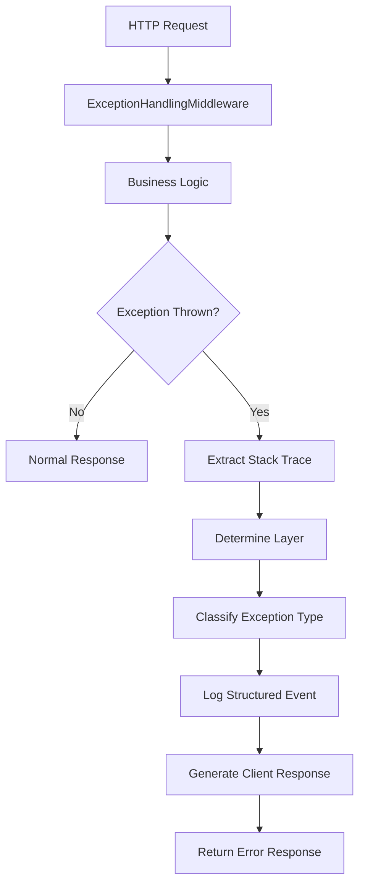

# Exception Handling Middleware POC

**Policy Management System with Centralized Technical Exception Handling**

## Project Overview

This is a **Proof of Concept (POC)** demonstrating a comprehensive middleware-based exception handling framework for ASP.NET Core Web APIs. The implementation showcases centralized technical exception management while maintaining clear separation from business logic errors.

### Key Features

- **Centralized Exception Handling**: Single middleware intercepts all unhandled technical exceptions
- **Structured Logging**: Comprehensive error tracking with trace IDs and source code location
- **Layer Detection**: Automatic identification of exception origin (Controller/Service/Repository/Middleware)
- **Stack Trace Analysis**: Pinpoint exact file, method, and line number of failures
- **Standardized API Responses**: Consistent error response format across all endpoints
- **Security-First Design**: No internal implementation details exposed to clients

## Architecture

### Core Components

```
PolicyManagement/
├── Middleware/
│   └── ExceptionHandlingMiddleware.cs    # Primary exception interceptor
├── LoggerService/
│   ├── ILoggerService.cs                 # Structured logging interface
│   ├── LoggerService.cs                  # JSON-based logging implementation
│   └── Models/
│       └── LogEvent.cs                   # Log event structure
├── Controllers/
│   ├── PolicyController.cs               # Business logic + test endpoints
│   ├── LoginController.cs                # JWT authentication
│   └── UserController.cs                 # User management
├── Services/                             # Business service layer
├── Repositories/                         # Data access layer
└── Program.cs                            # Middleware registration
```

### Middleware Pipeline Order

```
HTTP Request
    ↓
ExceptionHandlingMiddleware      # 1. Technical exception interceptor
    ↓
Authentication Middleware        # 2. JWT validation
    ↓
Authorization Middleware         # 3. Role-based access control
    ↓
Controllers/Actions              # 4. Business logic execution
    ↓
HTTP Response
```

## Exception Handling Framework

### Technical Exception Categories

The middleware handles **technical/infrastructure failures only**:

| Exception Type | HTTP Status | Response Message | Use Case |
|----------------|-------------|------------------|----------|
| `DbUpdateException` | 500 | Database error occurred | PostgreSQL failures |
| `NpgsqlException` | 500 | Database error occurred | Connection issues |
| `TimeoutException` | 408 | Request timed out | Operation timeouts |
| `UnauthorizedAccessException` | 401 | Unauthorized access | Security violations |
| `InvalidOperationException` (JWT) | 401 | Authentication error | JWT validation failures |
| `HttpRequestException` | 502 | External service failure | API communication errors |
| `IOException` | 500 | File operation failed | File system errors |
| `NullReferenceException` | 500 | System error occurred | Runtime null references |
| `ArgumentNullException` | 500 | System error occurred | Invalid arguments |
| `KeyNotFoundException` | 404 | Resource not found | Missing data lookups |
| **Default** | 500 | Unexpected error occurred | Unknown technical failures |

### Exception Processing Flow



## Logging & Observability

### Structured Log Format

```json
{
  "timestamp": "2026-02-10T12:30:45.123Z",
  "traceId": "0HN7SPBVK3QK2:00000001",
  "message": "Technical exception occurred. Path: /api/policies/123...",
  "level": "Error",
  "method": "GET",
  "endpoint": "/api/policies/123",
  "statusCode": 500,
  "service": {
    "name": "PolicyManagement",
    "eventName": "TECHNICAL_EXCEPTION"
  },
  "exceptionSource": {
    "layer": "Service",
    "className": "PolicyService",
    "methodName": "GetPolicyByIdAsync",
    "sourceFile": "PolicyService.cs",
    "lineNumber": 42,
    "exceptionType": "System.Data.SqlClient.SqlException"
  }
}
```

### Request Tracing

**Implementation:**
- **ASP.NET Core TraceIdentifier**: Built-in `HttpContext.TraceIdentifier` used for request tracking
- **Automatic Generation**: Each request gets a unique trace identifier
- **Exception Logging**: Trace ID included in all exception logs
- **Client Response**: Trace ID returned in error responses for debugging

## API Response Format

### Success Response
```json
{
  "success": true,
  "statusCode": 200,
  "message": "Request processed successfully",
  "data": { ... },
  "traceId": "0HN7SPBVK3QK2:00000001"
}
```

### Error Response (Technical Exception)
```json
{
  "success": false,
  "statusCode": 500,
  "message": "A system error occurred. Please contact support.",
  "traceId": "0HN7SPBVK3QK2:00000001",
  "timestamp": "2026-02-10T12:30:45.123Z"
}
```

## Technology Stack

- **Framework**: ASP.NET Core Web API (.NET 10.0)
- **Database**: PostgreSQL with Entity Framework Core
- **Authentication**: JWT Bearer tokens
- **Logging**: Serilog with structured JSON logging
- **ORM**: Entity Framework Core with Npgsql provider
- **Serialization**: System.Text.Json

## Configuration

### appsettings.Development.json
```json
{
  "Logging": {
    "LogLevel": {
      "Default": "Information",
      "Microsoft.AspNetCore": "Warning"
    }
  },
  "Jwt": {
    "Key": "your-secret-key",
    "Issuer": "PolicyManagementApp",
    "Audience": "PolicyManagementAppUsers",
    "ExpiryMinutes": 60
  },
  "ConnectionStrings": {
    "PolicyManagementDbConnectionString": "Host=localhost;Port=5432;Username=postgres;Password=your-password;Database=CSharp"
  }
}
```

## Testing the Middleware

### Test Endpoints

The `PolicyController` includes test endpoints to verify exception handling:

```http
GET /api/policies/test-null-ref          # NullReferenceException → 500
GET /api/policies/test-arg-null          # ArgumentNullException → 500
GET /api/policies/test-key-not-found     # KeyNotFoundException → 404
GET /api/policies/test-timeout           # TimeoutException → 408
GET /api/policies/test-unauthorized      # UnauthorizedAccessException → 401
GET /api/policies/test-http-request      # HttpRequestException → 502
GET /api/policies/test-io                # IOException → 500
GET /api/policies/test-invalid-op-jwt    # JWT InvalidOperationException → 401
```

### Example Test Request

```bash
curl -X GET "https://localhost:5001/api/policies/test-timeout" \
  -H "Authorization: Bearer your-jwt-token"
```

**Response:**
```json
{
  "success": false,
  "statusCode": 408,
  "message": "The request timed out. Please contact support.",
  "traceId": "0HN7SPBVK3QK2:00000001",
  "timestamp": "2026-02-10T12:30:45.123Z"
}
```

## Key Implementation Details

### 1. Stack Trace Extraction
```csharp
var stackTrace = new System.Diagnostics.StackTrace(exception, true);
var frame = stackTrace.GetFrame(0);
var sourceFile = frame?.GetFileName() ?? "Unknown";
var lineNumber = frame?.GetFileLineNumber() ?? 0;
```

### 2. Layer Detection Logic
```csharp
private static string DetermineLayer(string className, string sourceFile)
{
    if (className.Contains("Controller") || sourceFile.Contains("Controllers"))
        return "Controller";
    if (className.Contains("Service") || sourceFile.Contains("Services"))
        return "Service";
    if (className.Contains("Repository") || sourceFile.Contains("Repositories"))
        return "Repository";
    if (className.Contains("Middleware"))
        return "Middleware";
    return "Unknown";
}
```

### 3. Exception Classification
```csharp
private static (HttpStatusCode statusCode, string message) GetExceptionDetails(Exception exception)
{
    return exception switch
    {
        DbUpdateException or NpgsqlException => 
            (HttpStatusCode.InternalServerError, "A database error occurred. Please contact support."),
        TimeoutException => 
            (HttpStatusCode.RequestTimeout, "The request timed out. Please contact support."),
        // ... additional mappings
        _ => (HttpStatusCode.InternalServerError, "An unexpected error occurred. Please contact support.")
    };
}
```

## Business Logic Separation

**❌ NOT Handled by Middleware (Business Exceptions):**
- Validation errors (`FluentValidation`, `DataAnnotations`)
- Business rule violations
- Domain state conflicts
- User input errors

**✅ Handled by Middleware (Technical Exceptions):**
- Database connectivity issues
- Authentication/authorization failures
- External service communication errors
- Runtime system exceptions
- Infrastructure failures

## Security Considerations

- **No Stack Traces**: Never exposed to clients
- **No Internal Paths**: File paths sanitized in responses
- **Generic Messages**: Technical details hidden from external users
- **Full Internal Logging**: Complete diagnostic information preserved for developers
- **Correlation Tracking**: Enable request tracing without exposing system internals

## Getting Started

1. **Clone Repository**
   ```bash
   git clone <repository-url>
   cd sameer-dotnet-training
   ```

2. **Setup Database**
   ```bash
   # Update connection string in appsettings.Development.json
   dotnet ef database update
   ```

3. **Run Application**
   ```bash
   cd PolicyManagement
   dotnet run
   ```

4. **Test Middleware**
   ```bash
   # Visit test endpoints to see exception handling in action
   curl https://localhost:5001/api/policies/test-timeout
   ```

## POC Outcomes

This POC demonstrates:

✅ **Complete exception coverage** across the entire HTTP pipeline  
✅ **Zero code duplication** - no try-catch blocks in controllers  
✅ **Structured observability** with ASP.NET Core trace tracking  
✅ **Production-ready security** - no internal details leaked  
✅ **Developer-friendly diagnostics** with precise error location  
✅ **Consistent API contract** for all technical failures  
✅ **Clear separation of concerns** between technical and business errors  
✅ **Simple implementation** - single middleware handles all technical exceptions


---

**Author**: Sameer Divami  
**Framework**: ASP.NET Core 10.0  
**Purpose**: Technical Exception Handling Middleware POC
